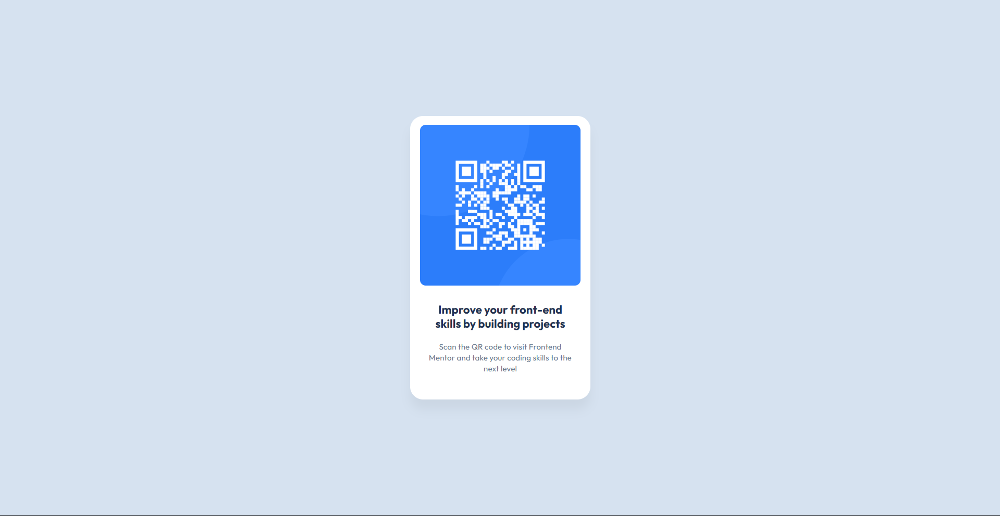

# Frontend Mentor - QR code component solution

This is a solution to the [QR code component challenge on Frontend Mentor](https://www.frontendmentor.io/challenges/qr-code-component-iux_sIO_H). Frontend Mentor challenges help you improve your coding skills by building realistic projects. 

## Table of contents

- [Overview](#overview)
  - [Screenshot](#screenshot)
  - [Links](#links)
- [My process](#my-process)
  - [Built with](#built-with)
  - [What I learned](#what-i-learned)
  - [Continued development](#continued-development)
  - [Useful resources](#useful-resources)
- [Author](#author)
- [Acknowledgments](#acknowledgments)

**Note: Delete this note and update the table of contents based on what sections you keep.**

## Overview

### Screenshot

### Links

- Live Site URL: [https://kr0ma-git.github.io/Frontend-Mentor-Challenge-1/](https://kr0ma-git.github.io/Frontend-Mentor-Challenge-1/)

## My process

- Linked a stylesheet to the index.html.
- Initialized everything to have no pre-assigned values within the css.
- Imported the font.
- Made a flexbox and formatted the texts first.
- Added the image, resizing as needed and adjusting for margins and positioning.

### Built with

- Semantic HTML5 markup
- CSS custom properties
- Flexbox
- [Google Fonts](https://fonts.google.com)

### What I learned

Still need to improve on flexbox formatting especially when images are involved. Definitely needed some external help in terms of resizing the image (used transform() which I didn't know didn't actually change the image's size but just how it looks on the page itself).  

### Continued development

Definitely need to get used to working with flexboxes more and changing their sizes to specifications.

### Useful resources

- [GitHub Pages](https://www.pages.github.com) - GitHub Pages is really useful for hosting your projects without the need to buy domains.
- [Figma](https://www.figma.com) - Since the project was "Free+", I just had to check out what they offered through the figma file and it turns out that they gave really useful information like font sizes, colors, and overviews.

## Author

- Frontend Mentor - [@kr0ma-git](https://www.frontendmentor.io/profile/kr0ma-git)
- GitHub - [kr0ma-git](https://github.com/kr0ma-git)